# TextyTabBar

     
   

This package provides a beautiful easy to use custom UITabBarController

 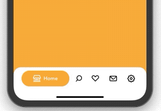 

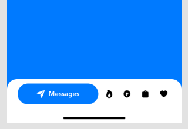 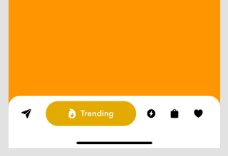 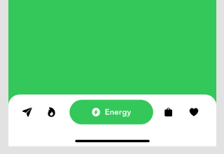 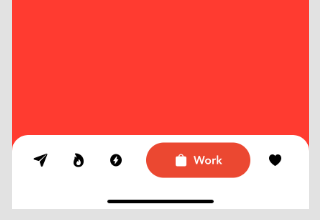 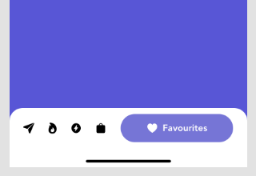  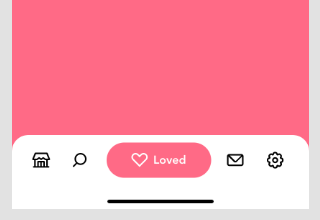 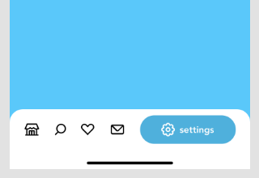

## Installation
### Swift Package Manager
The Swift Package Manager is a tool for automating the distribution of Swift code and is integrated into the swift compiler.
To integrate using Apple's Swift package manager from xcode :

File -> Swift Packages -> Add Package Dependency... 

enter package URL : https://github.com/kerollesroshdi/TextyTabBar.git , choose the latest release

## Usage
#### set UITabBarController class to TextyTabBarController
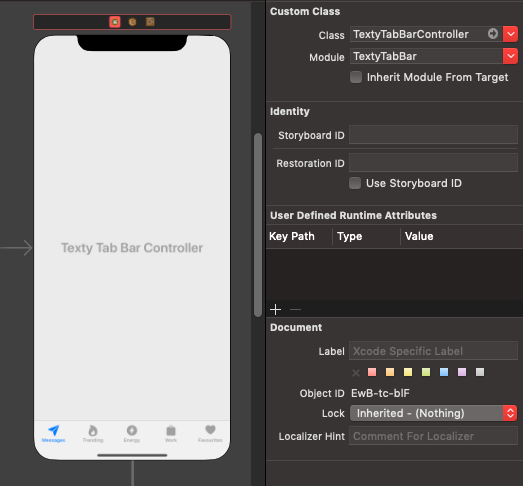 

#### set UITabBarItem class to TextyTabBarItem
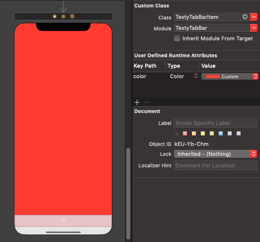 

#### set UITabBarItem Color & image and title
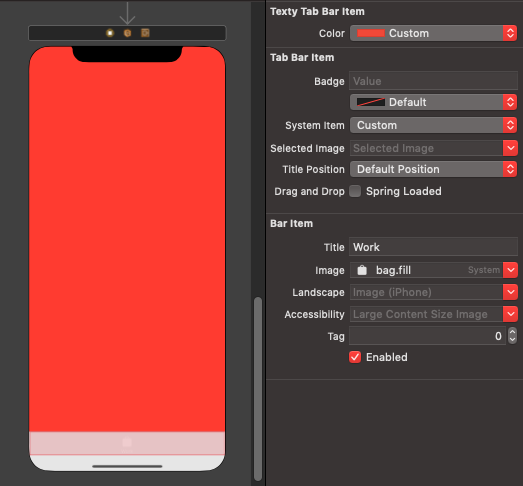

## Licence
TextyTabBar is released under an MIT license. See [License](https://github.com/kerollesroshdi/TextyTabBar/blob/master/LICENSE) for more information.
